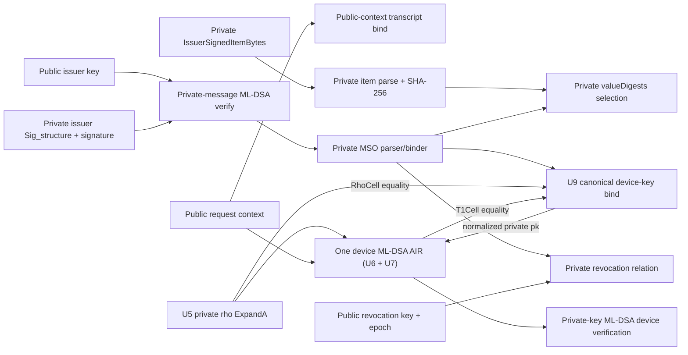

# Quantum-safe TS13 unlinkable age-over-18 demo profile

Status: proposed design specification; implementation is explicitly out of
scope for this document.

Specification base:

- EUDI ARF Technical Specification 13,
  `docs/technical-specifications/ts13-zksnarks.md`, pinned at commit
  `230cd75d9c243e6b4c7b35f3f2bf73f9dff20cdc`.
- `feat/quantum-safe` pinned at
  `20f9d7a86bac57286ff9ea4a328956f25f5d1ac8`.

Wallet-framework and application integration are deliberately outside this
document. This specification ends at the `proveIdentity`/`verifyIdentity`
boundary and the opaque TS13 `ZkDocument.proof` bytes.

The words **MUST**, **MUST NOT**, **SHOULD**, and **MAY** are normative.
Comments in the implementation are not evidence of conformance. Executable
constraints, transcript construction, serialization, and adversarial tests are
the authorities.

## 1. Objective

This profile constrains the following statement without placing the credential
facts in the semantic public statement:

> A trusted issuer issued this holder a currently valid PID containing
> `age_over_18 = true`; the holder authenticated this exact presentation with
> the device key bound into that credential; and the credential is not revoked
> in the verifier-selected revocation epoch.

The application-facing proving call remains:

```kotlin
val proof: ByteArray = proveIdentity(statement, witness)
```

The returned bytes are exactly the opaque `ZkDocument.proof` value. The EUDI
presentation layer, not `proveIdentity`, constructs the surrounding
`ZkDocument`.

The implementation is a demonstration profile, not a production deployment
profile. It deliberately supports one claim and one fixed credential shape.
It uses post-quantum authentication throughout, but retains the branch's
current STARK security parameters and therefore makes no 128-bit
post-quantum-security claim.

## 2. Privacy claim and explicit limitation

This profile requires **public-input unlinkability**:

- two conforming credentials from the same issuer have the same
  credential-independent public theorem;
- repeated presentations of one credential expose only fresh request context;
- no credential-stable value is used to choose a circuit, trace layout, proof
  length, or public preprocessing root.

STWO is currently transparent, not zero knowledge. Witness-derived committed
trace data, openings, and claimed sums may therefore remain visible inside the
STARK proof until masking is added to the proof system. Per project scope,
proof-system masking is not specified here. The implementation MUST describe
itself as:

```text
public-input unlinkable; transcript zero knowledge pending
```

It MUST NOT claim complete transcript unlinkability or zero knowledge before
that later protocol work lands.

The future masking layer must not require another public/private theorem
redesign. Everything that must ultimately remain private is already private in
this profile.

## 3. Fixed profile

The profile identifier is:

```text
ts13-pid-age-over-18-unlinkable-demo-v1
```

The proof-system name exposed through `ZkSystemSpec.system` is:

```text
stwo-euid-ts13-demo-v1
```

The profile supports exactly:

| Parameter                     | Value                              |
| ----------------------------- | ---------------------------------- |
| credential format             | `mso_mdoc_zk`                      |
| document type                 | `eu.europa.ec.eudi.pid.1`          |
| namespace                     | `eu.europa.ec.eudi.pid.1`          |
| requested element             | `age_over_18`                      |
| comparison                    | equality                           |
| public result                 | CBOR `true` (`0xf5`)               |
| issuer authentication         | FIPS 204 ML-DSA-65                 |
| device authentication         | FIPS 204 ML-DSA-65                 |
| revocation authentication     | FIPS 204 ML-DSA-65                 |
| digest algorithm              | SHA-256                            |
| device authentication profile | ISO 18013-5 `DeviceAuthentication` |
| potential issuers per proof   | exactly one                        |
| disclosed attributes          | exactly one                        |
| revocation                    | mandatory                          |
| timestamp precision           | UTC whole Unix second              |

This theorem verifies an issuer-signed `age_over_18 = true` attribute. It does
not calculate age from a birth date. A birth-date predicate is a separate
profile and MUST NOT be silently substituted.

The profile MUST reject extra requested claims, alternate namespaces,
alternate document types, extension claims, optional revocation, and any
algorithm other than the values above.

### 3.1 Fixed credential shape

The demo issuer MUST generate two or more credentials with identical
serialization shape but different credential data. The following values are
universal public profile constants, never credential-selected proof or
statement fields:

- issuer COSE `Sig_structure` byte length;
- MSO payload byte length;
- padded `IssuerSignedItemBytes` byte length;
- maximum device COSE `Sig_structure` length;
- CBOR integer-width classes used by digest identifiers;
- all trace log sizes, row counts, stream identifiers, and relation counts.

The fixture generator MUST produce a canonical `shape-manifest.cbor` containing
the exact numeric constants. The circuit artifact commits to that manifest.
Every demo credential fixture MUST match it byte-for-byte at the shape level.

The request-derived device COSE `Sig_structure` is the one variable-length
public input. Its capacity MUST be measured before the shape manifest is
frozen:

1. capture the canonical `Sig_structure` from every presentation flow supported
   by the intended demo application, including the largest reader-key and
   handover variants;
2. record the corpus and maximum observed byte length;
3. set `DEVICE_SIG_STRUCTURE_CAPACITY` to the next power of two greater than or
   equal to `maximumObservedLength + 128`; and
4. commit the corpus digest, observed maximum, and selected capacity to the
   shape manifest.

The trace always allocates the selected capacity and its maximum Keccak
schedule. A verifier-derived active length controls the SHAKE padding position;
all inactive bytes and unused permutation rows are constrained to the profile's
canonical inactive values. The active length is public request context, is
transcript-bound, and MUST NOT change the trace geometry, tree-zero root,
circuit hash, or fixed proof-container length. A larger input fails with
`InvalidPublicContext`; increasing the capacity requires a new circuit hash.

Different credential values MUST still include different:

- MSO bytes;
- device public keys;
- item randomizers;
- digest identifiers;
- issuer, device, and revocation signatures;
- revocation identifiers and, where practical, signed gap witnesses.

If a credential does not match the fixed shape, `proveIdentity` MUST return
`UnsupportedDemoCredentialShape`. It MUST NOT select a different length bucket
or profile. This fail-closed rule is what prevents credential-specific lengths
from becoming linkability signals.

## 4. Threat model

The construction protects against:

- a malicious holder attempting to prove a false claim;
- a malicious prover choosing self-consistent but unauthenticated circuit
  witnesses;
- a verifier or intermediary relabelling a proof for another relying party,
  session, timestamp, trust configuration, or revocation epoch;
- colluding relying parties comparing public statements, circuit choices,
  public preprocessing roots, clear envelope headers, and envelope sizes.

Until masking is added, the final item is limited to those clear surfaces. No
claim is made about credential-dependent data that an adversary may extract
from the transparent STARK body.

The construction assumes:

- the issuer and revocation authority public keys are obtained from verifier
  policy, not from prover-controlled proof bytes;
- the issuer emits the canonical, fixed-shape CBOR profile;
- the verifier supplies or validates a fresh exact timestamp;
- the SessionTranscript contains a fresh verifier challenge and the relying
  party enforces its replay policy;
- ML-DSA-65, SHA-256, and the STARK are sound under the selected demo
  parameters; and
- a later STWO masking layer hides witness-dependent proof-transcript data.

The issuer key, proof profile, claim type, and revocation epoch intentionally
partition the anonymity set. Unlinkability is only claimed among credentials
inside the same partition.

## 5. Normative public/private boundary

### 5.1 Public inputs

The complete public surface is split into four disjoint allowlists.

The semantic statement supplied by verifier policy contains only:

| Public value                        | Reason                        |
| ----------------------------------- | ----------------------------- |
| actual circuit hash                 | circuit selection             |
| RP-local `zkSystemId`               | request binding               |
| document type                       | requested credential type     |
| namespace                           | requested claim scope         |
| element identifier                  | requested claim               |
| expected value `true`               | disclosed result              |
| canonical SessionTranscript bytes   | presentation binding          |
| exact verification Unix second      | validity decision             |
| trusted issuer ML-DSA-65 public key | issuer trust                  |
| revocation ML-DSA-65 public key     | revocation trust              |
| revocation epoch                    | freshness/anonymity partition |

The issuer and revocation keys are verifier authority. A value copied out of
the proof envelope is never authority.

The only derived public circuit values are:

- `SHA-256(canonicalSessionTranscript)`;
- the canonical request-derived device COSE `Sig_structure`, its public length,
  and its SHA-256 digest;
- the canonical UTC RFC 3339 rendering of the verification second; and
- the Section 6 request-context digest.

They are reconstructed from the semantic statement and are not independent
caller-controlled fields.

The V4 clear envelope header contains only its fixed magic, envelope version,
circuit hash, and fixed body-capacity value. Universal circuit constants are
the fixed profile strings, shape manifest, trace geometry, cryptographic
parameters, and maximum device-message capacity.

### 5.2 Private witness

The following MUST be absent from the semantic public statement, envelope
header, circuit/profile selector, public preprocessing, and verifier API:

| Private value                                                        | Required proof use                         |
| -------------------------------------------------------------------- | ------------------------------------------ |
| issuer COSE `Sig_structure` and MSO payload                          | issuer signature and MSO parsing           |
| issuer signature                                                     | issuer authentication                      |
| MSO `validFrom` and `validUntil`                                     | exact validity comparison                  |
| MSO device public key, including `rho`, `t1`, and `tr`               | device-key binding and ML-DSA verification |
| device signature                                                     | holder authentication                      |
| selected `IssuerSignedItemBytes`                                     | claim proof                                |
| item randomizer                                                      | item digest                                |
| digest identifier and CBOR encoding width                            | private `valueDigests` selection           |
| credential-selected item/MSO/issuer-message length or padding bucket | prohibited by the fixed profile            |
| private offsets, anchors, parser state, and active lengths           | private parsing                            |
| MSO digest and derived revocation identifier                         | revocation relation                        |
| revocation interval endpoints and signature                          | non-revocation proof                       |
| credential or certificate serial number                              | forbidden stable identifier                |

The request-derived device COSE `Sig_structure` is not credential-stable and
MAY remain public. Its length is public request context. Universal credential
shape constants are also public. The device public key and device signature
MUST remain private.

### 5.3 Exact public statement

The native verifier input is conceptually:

```rust
pub struct Ts13DemoPublicStatementV1 {
    pub circuit_hash: [u8; 32],
    pub zk_system_id: String,
    pub document_type: String,
    pub namespace: String,
    pub element_identifier: String,
    pub expected_value_cbor: Vec<u8>,
    pub timestamp_epoch_seconds: i64,
    pub session_transcript: Vec<u8>,
    pub trusted_issuer_public_key: [u8; 1952],
    pub revocation_public_key: [u8; 1952],
    pub revocation_epoch: u32,
}
```

Fixed profile strings may be represented as enum variants internally, but the
verifier MUST validate the caller-supplied values before proof verification.
The verifying caller is authoritative for `timestamp_epoch_seconds`; a proof
or witness cannot mint or override it. Any application clock-skew/freshness
policy is outside this core API and must run before constructing the verifier
statement.

There is no `current_date_epoch_day`, trusted-key list, resource-cap field,
credential length, digest identifier, device key, or prover-supplied
request-binding hash.

Tests MUST maintain separate exhaustive allowlists for the semantic statement,
derived circuit values, V4 header, and universal circuit constants. They MUST
destructure every typed field without `..`, then assert that the union is the
complete clear public surface. Adding any field requires an explicit privacy
review.

## 6. Presentation-context binding

### 6.1 Canonical context

The prover and verifier independently construct the following deterministic
CBOR array:

```text
[
  "EUDI-TS13-DEMO-CONTEXT-V1",
  "stwo-euid-ts13-demo-v1",
  zkSystemId,
  circuitHashBytes,
  "eu.europa.ec.eudi.pid.1",
  "eu.europa.ec.eudi.pid.1",
  "age_over_18",
  h'f5',
  timestampEpochSeconds,
  SHA-256(canonicalSessionTranscriptBytes),
  SHA-256(deviceCoseSigStructureBytes),
  SHA-256(trustedIssuerPublicKey),
  SHA-256(revocationPublicKey),
  revocationEpoch
]
```

Encoding rules are:

- deterministic CBOR as defined by RFC 8949;
- definite lengths only;
- shortest integer encodings;
- UTF-8 strings exactly as shown;
- `circuitHashBytes` and all digests encoded as 32-byte byte strings;
- `h'f5'` is a one-byte byte string containing the canonical CBOR value, not
  the boolean itself;
- whole-second signed Unix time with no fractional component;
- no trailing bytes.

The request-context digest is:

```text
SHA-256(canonicalContextCbor)
```

### 6.2 STARK transcript binding

A zero-column `Ts13PublicContextBindV1` AIR component MUST mix, in order:

1. the ASCII domain `EUDI-TS13-PUBLIC-CONTEXT-V1`;
2. the 32 request-context digest bytes;
3. the 32 actual circuit-hash bytes.

The bytes MUST be mixed identically by prover and verifier before any
challenge whose value affects the proof. The component is part of the frozen
module order and circuit artifact.

The verifier computes the digest only from its expected statement and policy.
The envelope does not carry an authoritative digest. An optional diagnostic
echo would be redundant and is therefore prohibited in V4.

Changing any context field and recomputing mutable transport metadata MUST
leave the inner proof invalid. In particular, a proof cannot be relabelled to:

- another `zkSystemId`;
- another SessionTranscript;
- another timestamp, including another second on the same day;
- another issuer key;
- another revocation key or epoch; or
- another claim/profile.

### 6.3 DeviceAuthentication derivation

The public statement carries the exact canonical SessionTranscript bytes. The
statement builder MUST fully consume the supplied CBOR, deterministically
re-encode it, and reject it unless the bytes are already canonical.

The verifier MUST reconstruct the exact ISO 18013-5
`DeviceAuthenticationBytes` from:

- the exact, fully consumed SessionTranscript CBOR;
- the fixed document type;
- the fixed, empty device namespaces for this profile; and
- the fixed ISO 18013-5 device-authentication profile.

The deterministic construction is:

```text
emptyDeviceNamespacesBytes = CBOR({})
deviceAuthentication = [
  "DeviceAuthentication",
  decodedCanonicalSessionTranscript,
  "eu.europa.ec.eudi.pid.1",
  tag24(bstr(emptyDeviceNamespacesBytes))
]
DeviceAuthenticationBytes = CBOR(tag24(bstr(CBOR(deviceAuthentication))))
```

The SessionTranscript is embedded as its decoded CBOR value, not as a byte
string. Both tag-24 wrappers and the canonical empty-map byte `0xa0` are
mandatory.

It then constructs the exact canonical COSE signature message:

```text
deviceCoseSigStructure = CBOR([
  "Signature1",
  h'a1013830',  // protected { 1: -49 }
  h'',          // empty external AAD
  deviceAuthenticationBytes
])
```

The bytes of this complete `Sig_structure`, not merely
`DeviceAuthenticationBytes`, are the public ML-DSA message used by U7 and the
context digest.

The prover MUST NOT supply either derived value as authoritative input. If the
witness document contains a payload, protected header, external AAD, or
message, every byte must equal the reconstructed value.

## 7. Statement proven by the circuit

A proof verifies if and only if all of the following hold in the composed
constraint system.

### 7.1 Issuer authentication

1. The private issuer COSE `Sig_structure` has the fixed profile shape.
2. Its protected algorithm is ML-DSA-65 and its external AAD is empty.
3. Its private payload is the exact private MSO payload used everywhere else
   in the proof.
4. The private issuer signature verifies under the public trusted issuer key.
5. No issuer public key taken from an unprotected credential header can
   replace verifier trust.

### 7.2 Private MSO facts

The private, issuer-authenticated MSO proves:

1. `docType == "eu.europa.ec.eudi.pid.1"`;
2. `digestAlgorithm == "SHA-256"`;
3. `validFrom < timestamp < validUntil` using the exact public Unix second;
4. the canonical private device key is present in `deviceKeyInfo`; and
5. the selected private item digest occurs under the private digest
   identifier in the fixed namespace's `valueDigests` map.

The validity comparisons are strictly exclusive, matching the pinned TS13
text. Equality to either boundary MUST fail.

`MdocPrivateMsoValidityV2` supplies this fact. It parses the private tag-0 UTC
strings in the exact 20-byte form `YYYY-MM-DDTHH:MM:SSZ`, validates digits,
separators, Gregorian month/day/leap-year rules, `hour < 24`, `minute < 60`,
and `second < 60`, and constrains the supported demo year range
`2020..=2099`. It converts both private values to Unix seconds using
range-checked integer limbs. The verifier independently converts the public
`timestamp_epoch_seconds` to the same representation. The AIR proves the
nonzero, non-overflowing slacks:

```text
timestamp - validFrom >= 1
validUntil - timestamp >= 1
```

The existing inclusive epoch-day comparator is not authoritative for this
profile.

Host parsing MAY reject malformed inputs early, but none of these security
facts may exist only as a host precheck.

### 7.3 Requested item

The proof privately parses exactly one canonical, tag-24-wrapped
`IssuerSignedItemBytes` and proves:

1. its namespace is the fixed PID namespace;
2. `elementIdentifier == "age_over_18"`;
3. `elementValue` is exactly canonical CBOR `true`;
4. its randomizer and digest identifier are private;
5. SHA-256 of the exact signed item bytes equals the digest selected from the
   private MSO map; and
6. the same private digest-identifier cells are used on the item and MSO sides.

The disclosed `true` in `ZkDocumentData` is a public result, not a copy trusted
from the prover. Verification of this equality theorem authorizes it.

### 7.4 Device authentication

The proof establishes:

1. the private device public key is the exact key inside the authenticated
   private MSO;
2. the private device signature is a valid ML-DSA-65 signature;
3. the signed message is the exact public, request-derived COSE
   `Sig_structure` from Section 6.3, including the fixed protected header,
   empty external AAD, and reconstructed `DeviceAuthenticationBytes`; and
4. the key used by ML-DSA verification is the same key decoded from the MSO.

This section requires the complete U5/U6/U7/U9 chain in Section 8. A private
key hash alone is insufficient if the verifier still supplies `rho`, `t1`,
`tr`, or a native public-key fold.

### 7.5 Revocation

The private revocation identifier is:

```text
id = LE64(SHA-256(privateMsoPayload)[0..8])
```

The fixture issuer MUST reject identifiers `0` and `2^64 - 1` and MUST ensure
there are no collisions within the demo issuance set.

The circuit proves:

```text
idLo < id < idHi
```

and verifies a private ML-DSA-65 signature under the public revocation key on:

```text
LE64(idLo) || LE64(idHi) || LE32(revocationEpoch)
```

The proof binds the epoch to the public request. The identifier, interval
endpoints, private MSO digest, and signature remain private.

This derivation is acceptable only for the controlled demo issuance set.
Production uniqueness, collision handling, distribution, and epoch rollover
are separate work.

## 8. Required AIR composition

The implementation SHOULD reuse the fixed-shape Phase-1 prototypes rather
than reintroducing public messages or host parsing:

- private issuer-message provider;
- private MSO binder and complete padded SHA-256 binding;
- strict private outer/inner item CBOR parser;
- private item binder;
- private `valueDigests` scanner; and
- private revocation range/signature relation.

Those components have useful isolated and Phase-1 test coverage, but remain
reuse candidates until the final theorem is composition-audited.

The implementation MUST then complete the private-device-key path described
below. U8/GKR is not required.



### 8.1 U5: private `rho` and ExpandA

U5 MUST derive the ML-DSA matrix from the private key's `rho`; no matrix
coefficient may be supplied by the verifier.

The frozen construction uses:

- 30 row-major SHAKE-128 jobs for `rho || j || i`;
- six squeeze blocks per job;
- the FIPS rejection sampler over 3-byte candidates;
- acceptance only for the 23-bit value `< q = 8,380,417`;
- exactly 256 accepted coefficients per polynomial; and
- fail-closed rejection if six blocks do not suffice.

It emits canonical stage-zero `NttCell` tuples. Stream count, order, domains,
candidate schedule, and relation multiplicities are circuit constants.

The six-block cap is intentional: the five-block, 30-stream union-bound
overflow probability is above a literal proof-wide `2^-128` rail, while six
blocks makes overflow negligible for this demo.

### 8.2 U6: private A/t1 evaluation

U6 MUST remove every verifier-native use of the private device key. For the
demo, the selected construction is the prototyped inverse/Horner design, not
the broader NTT-domain refactor.

It MUST:

- consume U5 stage-zero matrix cells;
- perform all eight inverse-butterfly stages;
- apply the final inverse normalization `256^-1 mod q = 8,347,681`;
- constrain every butterfly twiddle, modular add/subtract reduction, quotient,
  and canonical output in `[0,q)`;
- scale and evaluate the 30 A polynomials at the existing post-tree-1
  challenges `(r,s)`;
- decode, multiply by `2^13`, and evaluate the six private `t1` polynomials;
- retain existing coefficient evaluation IDs `0..29`;
- use IDs `30..59` for A and `60..65` for t1; and
- serialize the fixed private-device evaluation vector as
  `[coeff 30, A 30, t1 6]`.

The `(r,s)` challenges MUST be drawn only after the base columns containing
these witnesses are committed. U6 and U7 MUST be contiguous parts of one
private-device ML-DSA AIR and reuse that challenge pair; a second independently
challenged AIR is prohibited.

The canonical t1 split is:

```text
t1 = lo9 + 512 * hi1
```

where `lo9` is range-checked to nine bits and `hi1` is boolean. U6 emits
`T1Cell(i,m,lo9,hi1)` for U9. A byte lookup without the split constraints is
not sufficient.

For each coefficient, U6 also proves the unique balanced radix-512
decomposition:

```text
2^13 * t1 = d0 + 512*d1 + 512^2*d2
```

with each `d + 256` range-checked to nine bits. Since
`2^13 * 1023 = q - 1`, this equality has no M31 alias in the permitted range.

U6 emits A and scaled-t1 `EvalAtRs` tuples with negative multiplicity. The
combined device fold consumes all 66 evaluations with positive multiplicity:
the existing 30 groups in the fixed
`[z_0..z_4,w_0..w_5,e_0..e_5,v_0..v_5,c,C_0..C_5]` order, followed by 30 A
groups and six scaled-t1 groups.

The fold MUST constrain the complete bivariate integer-lift identity:

```text
sum_{i=0..5} rhoRlc^i * (
    sum_{j=0..4} AHat[i][j] * zHat[j]
    - cHat * scaledT1Hat[i]
    - wHat[i]
    - (r^256 + 1) * vHat[i]
    - qHat(s) * eHat[i]
    - (s - B) * carryHat[i]
) = 0

qHat(s) = 1 - 16*s + 32*s^2
B = 512
scaledT1 = 2^13 * t1
```

Every hat denotes the exact balanced-radix-512 bivariate evaluation at the
shared post-commitment challenges `(r,s)`. `rhoRlc` is the independently drawn
row-folding challenge and is not the private ML-DSA key seed `rho`. The
constraint system MUST construct `qHat(s)` from the fixed coefficients
`[1,-16,32]`; it is not a witness or verifier-supplied evaluation. The signs,
the `(r^256 + 1)` polynomial-fold factor, the `(s - B)` carry factor, and all
six `v`, `e`, and carry evaluations are normative. A bare congruence modulo
`q` does not satisfy this requirement.

No verifier-native A, t1, `qHat`, or public-key fold value remains.

### 8.3 U7: private key hashing and device ML-DSA

U7 keeps the request-derived device message public but makes the device public
key private.

It MUST constrain:

```text
tr = SHAKE256(pkEncode, 64 bytes)
mu = SHAKE256(tr || 0x00 || 0x00 || deviceCoseSigStructure, 64 bytes)
```

and bridge the resulting values into the existing c-tilde, w1-encoding, and
SampleInBall jobs.

The private ML-DSA mode MUST transcript-mix:

- an explicit private-key mode tag;
- the public device message and length;
- the fixed namespace; and
- the fixed stream base.

It MUST NOT mix or serialize the private key, `rho`, `t1`, or `tr`.

The fixed bridge order is:

```text
[pk_tr, tr_mu, mu_ct, w1enc, ct_sib]
```

The verifier constructs no placeholder key that is subsequently decoded. Its
ML-DSA verifier API receives no device key bytes.

### 8.4 U9: private key/MSO binding

U9 binds the exact 1,952-byte FIPS `pkEncode` to the canonical private COSE key
inside the MSO.

The demo COSE key is fixed to:

```text
kty = 7
alg = -49
label -1 = 1,952-byte ML-DSA-65 pkEncode
```

The canonical MSO prefix currently represented by:

```text
6d 64 65 76 69 63 65 4b 65 79 49 6e 66 6f
a1 69 64 65 76 69 63 65 4b 65 79
a3 01 07 03 38 30 20 59 07 a0
```

is a fixed profile constant and part of the circuit artifact.

U9 uses 416 active rows: 32 `rho` rows and 64 five-byte groups for each of six
`t1` polynomials. For packed bytes `b0..b4`, it proves:

```text
b1 = l2 + 4*h6
b2 = l4 + 16*h4
b3 = l6 + 64*h2

u0 = b0 + 256*l2
u1 = h6 + 64*l4
u2 = h4 + 16*l6
u3 = h2 + 4*b4
```

Every `b0..b4` is range-checked to eight bits. The fragment widths are exact:

```text
l2 < 2^2   h6 < 2^6
l4 < 2^4   h4 < 2^4
l6 < 2^6   h2 < 2^2
```

They MUST be enforced by matching range tables or boolean decompositions, not
only by the linear reconstruction equations.

Each `u` is split into the same boolean `hi1` and nine-bit `lo9` represented
by U6. The first 32 bytes consume U5 `RhoCell` tuples. U9 re-emits one
normalized, private 1,952-byte field for U7's `SHAKE256(pkEncode)` job.

Substituting any key byte, start offset, packed fragment, `rho` cell, or `t1`
cell MUST make the composed proof invalid.

### 8.5 Frozen module and transcript order

Prover and verifier MUST use this exact high-level order:

1. shared SHA-256 tables;
2. shared ML-DSA/range tables;
3. shared Keccak service;
4. `Ts13PublicContextBindV1`;
5. private issuer-message provider;
6. issuer private-message ML-DSA;
7. requested-item SHA-256;
8. complete private MSO SHA-256;
9. private item CBOR parsers;
10. private item binder;
11. private MSO binder;
12. `MdocPrivateMsoValidityV2`;
13. private `valueDigests` scanner;
14. U5 private ExpandA;
15. U9 private device-key binder/normalizer;
16. one contiguous private-device ML-DSA AIR containing U6 and U7;
17. private revocation range;
18. private revocation ML-DSA;
19. public revocation key/epoch binding.

Relation handles, claim order, tree placement, challenge draw order, component
geometry, and public-mix order are part of the circuit artifact. Prover and
verifier MUST share one declarative profile definition; duplicated hand-built
orders are prohibited.

The following lookup graph is independently normative:

| Tuple                                            | Challenge owner                  | Producer/sign                                          | Consumer/sign and multiplicity                           |
| ------------------------------------------------ | -------------------------------- | ------------------------------------------------------ | -------------------------------------------------------- |
| issuer `FieldBytes(field,index,byte)`            | private issuer-message provider  | provider `-m`                                          | each parser/binder/U9 use `+1`; `m` is their checked sum |
| normalized device-key `FieldBytes(1,index,byte)` | shared issuer `FieldBytes` owner | U9 `-1`                                                | U7 `+1` for each of 1,952 bytes                          |
| `RhoCell(position,byte)`                         | U5                               | U5 `+1`                                                | U9 `-1` for each of 32 bytes                             |
| `NttCell(poly,stage,index,l0,l1,l2)`             | U5                               | U5 stage 0 and U6 stages 1..8 `+1`                     | U6 consumes each prior stage and final Horner input `-1` |
| `T1Cell(poly,index,lo9,hi1)`                     | U9                               | U6 `+1`                                                | U9 `-1` for each of 1,536 coefficients                   |
| `EvalAtRs(poly,e0,e1,e2,e3)`                     | private-device ML-DSA AIR        | coefficient AIR IDs 0..29 and U6 IDs 30..65, each `-1` | combined device fold `+1` for all 66 evaluations         |
| `MdocDevicePkStart(start)`                       | private MSO binder               | binder `-1`                                            | U9 `+1`                                                  |

U9 draws the `T1Cell` challenge before the contiguous device AIR; global LogUp
cancellation does not require the producer to appear first. Production MUST
NOT add balancing components that can satisfy a missing relation edge.

## 9. Circuit identity

TS13's `circuitHash` is a circuit commitment. The current branch hashes a
profile tuple, which is insufficient because constraint code can change
without changing that tuple.

This profile requires a reproducibly generated `circuit-artifact-v1.cbor`
containing at least:

- profile and constraint-system versions;
- the complete ordered component list;
- preprocessed, base, extension, and interaction column schemas;
- log sizes and active row counts;
- relation names, tuple shapes, and signs;
- transcript public-mix and challenge order;
- serialized claim order and fixed vector lengths;
- all fixed profile, CBOR-prefix, hash-stream, and range-table constants;
- the fixed-shape manifest digest;
- tree-zero/preprocessed-root derivation;
- proof-system field, PCS, FRI, query, and PoW parameters;
- proof/envelope serialization versions;
- enabled Cargo feature sets, `Cargo.lock` digest, and Rust toolchain; and
- one deterministic `soundnessSourceTreeDigest` covering the workspace
  `Cargo.toml` and the complete checked-in package trees of `air-core`,
  `predicates`, `stwo-sha256`, `stwo-keccak`, `stwo-mldsa`, `eu-id-prover`, and
  `sdk`.

The source-tree digest is the demo minimum bar: a manifest of sorted relative
paths and SHA-256 file digests is itself deterministically encoded and hashed.
The only exclusions are generated build output such as `target/` and the exact
generated shape-manifest, circuit-artifact, and circuit-hash embedding files
whose inclusion would be recursive. Those generated files are committed by
the shape digest, deterministic artifact derivation, and CI drift checks
instead. The generator MUST carry their exact relative paths in a closed
exclusion allowlist; it MUST NOT use an extensible ignore glob. This
intentionally conservative rule may rotate the circuit hash for an irrelevant
test or documentation edit, but a constraint, public-statement,
canonical-context, proof-envelope, or `proveIdentity`/`verifyIdentity` dispatch
edit cannot leave it unchanged. Any such logic moved into another local
package MUST add that complete package tree to the digest before the profile is
released. A future canonical algebraic-constraint representation MAY replace
this rule. Per-component source digests and constraint bytecode are not
required for this demo.

Its deterministic encoding follows the same CBOR rules as Section 6. The
actual circuit hash is:

```text
SHA-256(circuitArtifactBytes)
```

The raw 32 bytes appear in the V4 proof header and context digest. Any external
request encoding is specified separately from this core proof interface.

Any soundness-relevant code, layout, relation, transcript, constant, or proof
parameter change MUST change the artifact and circuit hash. CI MUST regenerate
the artifact and reject drift. A hash over a human-selected tuple MUST NOT be
labelled `circuitHash`.

## 10. Native API and proof envelope

### 10.1 API

The exported API remains one byte-returning function:

```rust
pub fn prove_identity(
    statement: ZkPublicStatement,
    witness: ZkMdocWitness,
) -> Result<Vec<u8>, ZkError>;
```

The arguments are tagged profile variants, not one record with optional TS13
fields:

```rust
pub enum ZkPublicStatement {
    ProductV1(ProductPublicStatementV1),
    Ts13DemoV1(Ts13DemoPublicStatementV1),
}

pub enum ZkMdocWitness {
    ProductV1(ProductMdocWitnessV1),
    Ts13DemoV1(Ts13DemoWitnessV1),
}

pub struct Ts13DemoWitnessV1 {
    pub document: Vec<u8>,
    pub revocation_id_lo: u64,
    pub revocation_id_hi: u64,
    pub revocation_signature: Vec<u8>,
}
```

UniFFI exposes it as:

```kotlin
fun proveIdentity(
    statement: ZkPublicStatement,
    witness: ZkMdocWitness,
): ByteArray
```

For this profile:

- the `Ts13DemoV1` statement contains the Section 5.3 public inputs, including
  the verifier-authoritative raw issuer and revocation keys;
- `witness.document` contains the raw canonical private mdoc presentation
  material;
- the witness contains the private revocation interval and signature;
- no trust key or trust-key hash exists in the witness; and
- mixed product/TS13 variants MUST fail before proving.

The corresponding verifier is:

```kotlin
fun verifyIdentity(
    statement: ZkPublicStatement,
    proof: ByteArray,
): ZkVerifyResult
```

`ZkVerifyResult.ok` is true only after the complete V4 theorem verifies.
Malformed inputs and unsupported profiles return the typed `ZkError`; they are
not mapped to a successful Boolean result.

### 10.2 V4 envelope

The proof byte string uses a fixed binary envelope:

```text
offset  size  field
0       8     ASCII "EUIDTS13"
8       2     little-endian envelope version = 4
10      32    raw circuit hash
42      4     little-endian profile body capacity P
46      P     canonical STARK proof followed by zero padding
```

`P` is a circuit-artifact constant, not the encoded proof's used length. It is
the smallest multiple of 65,536 bytes that covers the deterministic worst-case
serialization bound for the profile's query count, Merkle depths, FRI layers,
claims, and column widths. It MUST be derived from those maxima, not from a
sample set of proofs.

Current STWO Merkle decommitments deduplicate shared query subtrees, so the
canonical proof prefix can vary in length with challenge-derived query
positions even for one fixed circuit. The encoder writes that canonical prefix
and fills the remainder of the `P`-byte body with `0x00`. It serializes no used
length.

The decoder MUST reject:

- any other magic or version;
- an unknown circuit hash;
- a capacity field other than the artifact's `P`;
- a total envelope length other than `46 + P`;
- any claim/vector shape that differs from the artifact; and
- a V2/V3 body under the V4 system name.

It MUST decode exactly one bounded proof prefix, record the consumed cursor
position, reserialize the decoded proof and require byte equality with the
consumed prefix, then require every remaining capacity byte to be `0x00`.

V4 contains no serialized semantic statement, request-binding hash, device
key, MSO, digest identifier, or credential-selected shape.

The proof is deliberately uncompressed. Data-dependent compression length is
a metadata side channel and is unnecessary for the demo. Transport-level
compression MUST be disabled or applied to a separately padded fixed-size
transport. The variable canonical prefix length is challenge-randomness, not a
credential identifier, and lies inside the transparent proof body whose
confidentiality is explicitly deferred.

Legacy envelopes MAY remain supported under their legacy system identifiers.
They MUST NOT be accepted when `stwo-euid-ts13-demo-v1` is requested.

### 10.3 Errors

The implementation must distinguish at least:

- `UnsupportedProofSystem`;
- `UnsupportedCircuitHash`;
- `UnsupportedDemoCredentialShape`;
- `MalformedSessionTranscript`;
- `InvalidPublicContext`;
- `InvalidPrivateCredential`;
- `InvalidRevocationWitness`;
- `ProofGenerationFailed`;
- `MalformedProofEnvelope`;
- `ProofContextMismatch`; and
- `ProofVerificationFailed`.

Errors MUST NOT include private credential bytes, keys, signatures, offsets,
or revocation values.

## 11. Acceptance specification

### 11.1 Three-presentation unlinkability fixture

The mandatory fixture set is:

- **A1:** credential A under fresh context 1;
- **A2:** the same credential A under fresh context 2;
- **B:** a different credential B under fresh context 3.

Credentials A and B use the same issuer, profile, claim, and revocation policy,
but have different MSOs, item randomizers, digest identifiers, device keys,
signatures, revocation identifiers, and credential data. Their `validFrom` and
`validUntil` values MUST also differ while using the same encoded width and
remaining valid at the shared test timestamp.

Contexts 1 and 2 MUST use different RP-identifier lengths and different
SessionTranscript lengths within the selected capacity. This exercises the
fixed-capacity device-message and V4 padding rules rather than comparing only
same-length requests.

Control assertions MUST prove:

```text
MSO(A1) == MSO(A2)
MSO(A1) != MSO(B)
deviceKey(A1) == deviceKey(A2)
deviceKey(A1) != deviceKey(B)
```

All three proofs must verify.

After replacing only the explicitly fresh request-context fields with a
test marker:

- all serialized semantic public statements are byte-identical;
- all circuit/profile selectors are identical;
- all tree-zero/public preprocessing roots are identical;
- all V4 envelope lengths are identical; and
- no remaining V4 header field distinguishes A from B.

Proof-body byte equality is not required while STWO remains transparent.

### 11.2 Exact public-schema test

`ts13_public_schema_is_exact` MUST:

1. exhaustively destructure the public statement without `..`;
2. compare its field names with the Section 5.1 allowlist;
3. inspect the semantic public statement and V4 header for high-entropy
   forbidden marker contexts; and
4. fail if a new public field is added without updating this specification.

Semantic typed-field inspection is authoritative. Byte-run tests use only
high-entropy sentinels that cannot plausibly collide with allowed public keys,
such as a full MSO fragment or an encoded digest identifier concatenated with
its 32-byte selected digest. They MUST NOT scan one- or two-byte identifiers,
offsets, lengths, or buckets in isolation.

The forbidden semantic set includes:

- full or partial MSO runs;
- issuer or device signatures;
- full device key, `rho`, `t1`, or `tr`;
- digest identifier and selected digest context;
- item randomizer and private item encoding;
- validity timestamps;
- private offsets and length buckets;
- revocation identifier, endpoints, MSO digest, or signature; and
- certificate or credential serial numbers.

The test MUST NOT scan the transparent STARK body and then claim zero
knowledge. Proof-body confidentiality belongs to the later masking work.

### 11.3 Context-relabel test

`ts13_request_context_cannot_be_relabelled` MUST:

1. generate and verify one valid proof;
2. retain the exact V4 body;
3. change the RP-local identifier and verify failure;
4. change only the timestamp by one second on the same UTC day and verify
   failure;
5. change the SessionTranscript and verify failure;
6. change issuer and revocation policy fields and verify failure; and
7. reconstruct all mutable surrounding `ZkDocument` fields after each change.

The test is specifically intended to defeat the current mutable
`request_binding_hash` design. Failure because an old outer checksum was not
updated is not evidence.

### 11.4 Theorem negative tests

At minimum, proof verification MUST fail for:

| Area             | Mutation                                                                                            |
| ---------------- | --------------------------------------------------------------------------------------------------- |
| issuer           | signature, public key, protected algorithm, payload/MSO binding                                     |
| MSO              | docType, digest algorithm, device-key window, payload start                                         |
| validity         | expired, not-yet-valid, equality and ±1 second at either boundary, malformed RFC 3339               |
| item             | namespace, element name, `true` to `false`, randomizer, item bytes                                  |
| digest           | digest identifier, map key, selected digest, scanner position                                       |
| device context   | SessionTranscript, docType, device namespaces, COSE protected algorithm, external AAD, payload byte |
| device signature | signature encoding or signature value                                                               |
| revocation       | derived ID, lower/upper endpoint, strictness, signature, epoch                                      |
| role separation  | swap issuer, device, or revocation key/signature roles                                              |
| shape            | short/long MSO, item, issuer message, device message, capacity+1, extra CBOR                        |

### 11.5 U5/U6/U7/U9 negatives

The composed proof MUST additionally reject:

- wrong U5 `rho`, `(j,i)` domain, stream count/order, or squeeze block;
- accepting candidate `q`, rejecting a valid candidate, or accepting after the
  256th coefficient;
- a self-consistent forged A coefficient disconnected from SHAKE;
- a forged inverse-butterfly stage, inverse-normalization factor, or A/t1
  evaluation;
- an inverse-NTT modular alias, a `t1` value at 0 or 1023 with wrong
  `2^13` scaling digits, or a forged scaling carry;
- a changed `v`, `e`, or carry evaluation, an omitted correction term, or any
  sign change in the complete integer-lift fold;
- a witness-supplied `qHat`, wrong `[1,-16,32]` coefficient, wrong
  `(r^256 + 1)` factor, or wrong `(s - 512)` carry factor;
- reordered or wrong-length private evaluation vectors;
- a substituted 1,952-byte device key;
- wrong U9 key start, field identifier, byte position, packed fragment,
  boolean high bit, `RhoCell`, or `T1Cell`;
- a self-consistent alternate U9 byte/fragment decomposition;
- wrong U7 pk-to-tr, tr-to-mu, mu-to-c-tilde, w1, or SampleInBall bridge; and
- any missing or extra relation counterpart or claimed sum.

The key acceptance control is:

> A proof built with a device signature and ML-DSA witness for key K2 while
> the authenticated MSO contains key K1 must fail, even if all K2-side
> witnesses are internally consistent.

### 11.6 Proof-format compatibility tests

Tests MUST prove:

- V2/V3 envelopes are rejected under the V4 system identifier;
- product proofs cannot verify as this TS13 profile and vice versa;
- unknown circuit hashes fail before body decode;
- a wrong V4 capacity, nonzero padding byte, noncanonical proof prefix,
  truncation, and trailing byte all fail; and
- the decoded semantic result contains exactly the one public equality claim.

### 11.7 Proof shape and performance

No accepted, metadata-matched performance baseline exists for the pinned TS13
fixture in the branch's current benchmark log. Historical campaign
configurations reported multi-second proving and are not a valid basis for a
two-second normative gate.

Before performance is evaluated, run `pq_perf_probe` in three fresh release
processes and record commit, fixture, PCS configuration, feature set, thread
count, hardware, operating system, proof bytes, and peak memory. Run the same
protocol after Phase 1 and after U5/U6/U7/U9 composition.

Functional acceptance requires successful proof and verification without
resource failure and an exactly `46 + P` byte V4 envelope. Verification within
250 ms and proving within 2 seconds are aspirational demo objectives, not
conformance requirements, until matched measurements establish them. U8/GKR
MAY be designed only after the complete simple composition is measured and
shown unsuitable for the intended demo.

## 12. Implementation sequence

This ordering is normative because it preserves one testable trust boundary at
each step:

1. Freeze canonical A/B credentials, measure the supported transcript corpus,
   and select `DEVICE_SIG_STRUCTURE_CAPACITY`.
2. Capture the metadata-matched performance baseline.
3. Generate the shape/circuit artifact and derived proof-body capacity `P`.
4. Introduce V4, fixed-capacity padding, and strict legacy separation.
5. Replace the mutable request-binding hash with
   `Ts13PublicContextBindV1`.
6. Reuse and integrate the private issuer/MSO/item/valueDigests/revocation
   Phase-1 components plus `MdocPrivateMsoValidityV2`.
7. Integrate and re-review U5 private ExpandA.
8. Implement U9 and freeze its relation ownership.
9. Implement one contiguous private-device ML-DSA AIR containing U6 and U7.
10. Remove all verifier-native device-key computations and all host-only
    security checks superseded by the circuit.
11. Wire the typed `proveIdentity`/`verifyIdentity` variants.
12. Run the complete acceptance matrix and matched measurements before
    considering U8.

No step may temporarily publish a device key, MSO, digest identifier, or
credential-specific length under the new system identifier.

## 13. Non-goals

The following are deliberately outside this demo:

- STWO proof masking or a general zero-knowledge compiler;
- U8/GKR unless performance measurement triggers it;
- generic DCQL predicates or multiple claims;
- arbitrary PID/mdoc shapes or runtime length buckets;
- hiding the issuer, requested claim, proof profile, or revocation epoch;
- production PKI, `x5chain`, certificate validation, issuance, or trust-list
  distribution;
- a production revocation database, collision registry, or epoch rollover;
- wallet-framework, application, secure-key-store, or platform integration;
- compatibility with arbitrary legacy proof envelopes under the new system
  name; and
- a 128-bit post-quantum deployment-security claim.

## 14. Definition of done

The implementation conforming to this specification is complete only when:

1. `proveIdentity(statement, witness)` returns a valid fixed-capacity V4
   `ZkDocument.proof` byte string;
2. the exact theorem in Section 7 is constrained, not merely host-checked;
3. the Section 5 public allowlist is exhaustive;
4. the A1/A2/B test shows no credential-stable public theorem, tree-zero root,
   circuit choice, or proof length;
5. the context-relabel attack fails with an unchanged inner proof;
6. device-key substitution fails through the composed U5/U6/U7/U9 chain;
7. the circuit hash is derived from the reproducible artifact rather than the
   old tuple;
8. all negative, compatibility, and fixed-shape tests pass;
9. matched performance and peak-memory results are recorded without changing
   an acceptance threshold after measurement; and
10. documentation uses the exact claim
    `public-input unlinkable; transcript zero knowledge pending`.

## Appendix A. Reuse and gap map

| Requirement                      | Existing material                        | Status for this profile                                |
| -------------------------------- | ---------------------------------------- | ------------------------------------------------------ |
| app-facing `proveIdentity`       | `feat/quantum-safe`                      | retain interface; replace TS13 statement/envelope      |
| private issuer message/MSO/item  | `codex/unlinkability` at `4c06fed0`      | reusable after composition review                      |
| private `valueDigests` selection | `codex/unlinkability`                    | reusable                                               |
| private revocation relation      | `codex/unlinkability`                    | reusable for controlled demo                           |
| private ExpandA                  | parked U5 commit `0e60a4d3`              | credible isolated component; must compose with U6/U9   |
| private pk-to-tr/mu              | parked U7 commit `81946a21`              | credible scaffold; verifier key inputs must be removed |
| private A/t1 verifier evaluation | U6 design only                           | missing                                                |
| private packed-key/MSO binding   | U9 design only                           | missing                                                |
| strict exact-second validity     | current inclusive epoch-day comparator   | missing; V2 component required                         |
| immutable request context        | current outer hash only                  | missing; Section 6 required                            |
| actual circuit artifact/hash     | tuple hash only                          | missing; Section 9 required                            |
| fixed-capacity V4 encoding       | current variable-length compressed proof | missing                                                |
| STWO masking                     | not present                              | intentionally deferred                                 |

The isolated branch `codex/ts13-demo-unlinkable` contains exploratory U5/U7
integration work. It is not normative, is not part of this specification
delivery, and must not be treated as evidence that the composed theorem is
complete.
